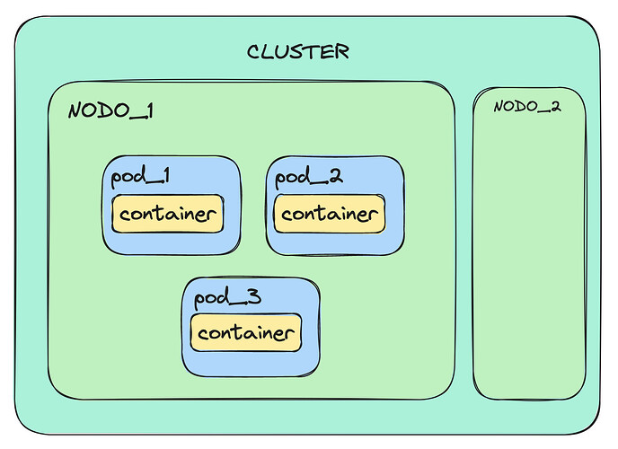
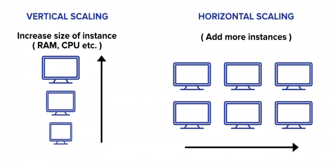

# INTRODUCCIÓN

[← Regresar a notas](../../README.md)  

----

[1. Kubernetes](#kubernetes-k8s)  
[2. Clúter y nodos](#clúster-y-nodos)  
[3. Escalabilidad](#escalabilidad)  
[4. Arquitectura K8s](#arquitectura-k8s)  
[5. Tipos de instalaciones K8s](#tipos-de-instalación-de-para-un-clúster-de-k8s)  

---

### Kubernetes (K8s)
Plataforma de orquestación de contenedores que permite automatizar el despliegue, la escalabilidad y la gestión de aplicaciones en contenedores a través de archivos de configuración yml.

---

### Clúster y nodos
Nodo se refiere a un componente de hardware conectado a una red, capaz de realizar procesamiento de datos. Por otra parte, un clúster es un grupo de nodos que trabajan en conjunto para proporcionar mayor capacidad de procesamiento a una aplicación.

---

### Minikube
Minikube es una herramienta que permite ejecutar un clúster de K8s localmente.

---

### Kubectl
Kubectl es la herramienta de línea de comandos utilizada para administrar clústeres de K8s.

---

### Escalabilidad
- **Escalabilidad vertical** 
Consiste en agregar más capacidad al mismo nodo para aumentar su capacidad de cómputo. Cuando el nodo alcance su límite no podrá seguir escalando.

- **Escalabilidad horizontal** 
Consiste en conectar más nodos sobre la misma red, que tengan las mismas características y que se adapten a la misma carga de trabajo.

> > **Caso de uso** 
> 
> Un sitio web de comercio electrónico se ejecuta en un servidor con 4 núcleos de CPU y 8GB de memoria RAM, y puede manejar un tráfico máximo de 1000 solicitudes por segundo.
>   
> En un día de gran demanda la carga de tráfico aumenta a 4000 solicitudes por segundo, lo que hace que el servidor se sobrecargue y las solicitudes se retrasen o fallen.
>   
> Para solucionar este problema, podemos escalar horizontalmente. Si cada nodo tiene la misma capacidad de procesamiento que el servidor original, entonces necesitaríamos agregar al menos tres servidores más para manejar el tráfico adicional.
> Con ello garantizamos que haya suficientes recursos para manejar la carga de trabajo de nuestros usuarios y tengan una experiencia fluida y sin interrupciones.

---

### Arquitectura K8s
Un clúster de kubernetes se compone de varios nodos, que se agrupan en <u>nodos master</u> y <u>nodos workers</u>. 
Los nodos master controlan la infraestructura del cluster y por otra parte los nodos workers alojan a nuestras aplicaciones.

#### Nodos master:

- **API Server** 
Provee interacción con las herramientas de administración, como el kubectl o el kubernetes dashboard. Además, permite que los nodos workers se comuniquen con los otros componentes del nodo master.

- **ETCD** 
Provee almacenamiento para mantener la configuración y el estado del clúster.

- **Scheduler** 
Asigna los contenedores de una aplicación a los nodos del clúster. Además, monitorea los recursos que consumen los contenedores.

- **Controller Manager** 
Garantiza que los objetos del clúster se mantengan en el estado deseado.

- **Kubelet** 
Garantiza que los contenedores dentro de los pods estén ejecutándose y en un estado saludable.
  - Recibe información sobre los pods desde el API Server.
  - Si un pod no está en ejecución o en estado saludable, entonces el kubelet toma medidas para corregir la situación. Puede iniciar, reiniciar o detener contenedores según sea necesario.
  - Interactúa con Docker para gestionar directamente los contenedores dentro de los pods.

---

### Tipos de instalación de para un clúster de K8s

Los clústers de K8s pueden ser On-Premise o gestionados por cloud providers, tales como:
- Azure Kubernetes Service (AKS)
- Amazon Elastic Kubernetes Service (EKS)
- Google Kubernetes Engine (GKE). 

Así mismo, los clústers de K8s debe ser configurados y desplegados de acuerdo a las necesidades del proyecto.

| Tipo de intalación               | Descripción                                                                                                                   |  
|----------------------------------|-------------------------------------------------------------------------------------------------------------------------------|
| `All-in-One`                     | - Todos los objetos de K8s se ejecutan en un solo nodo.   - Es útil para fines de desarrollo, por ejemplo, con `Minikube`. |
| `Single-Master and Multi-Worker` | Un nodo master gestiona varios nodos workers, lo que permite una mayor escalabilidad y redundancia.                           |
| `Multi-Master and Multi-Worker`  | Varios nodos master gestionan varios nodos workers, lo que proporciona alta disponibilidad y redundancia.                     |