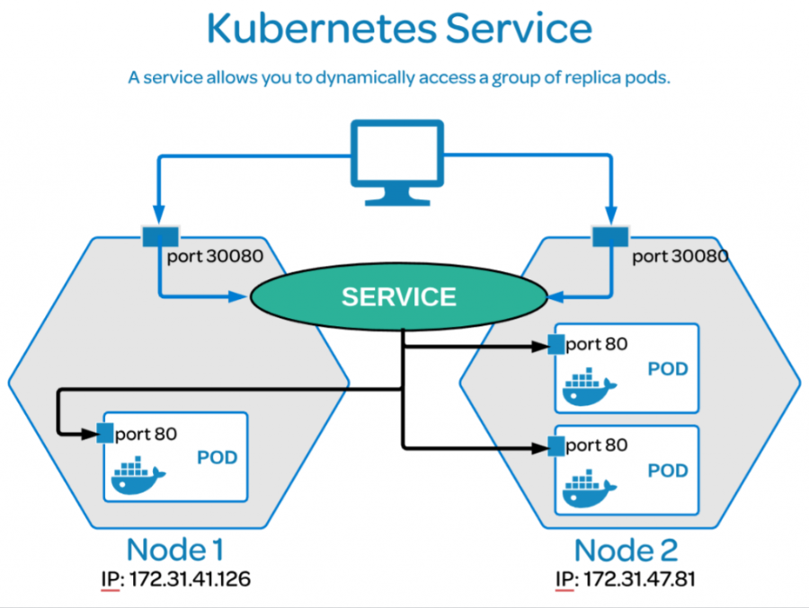
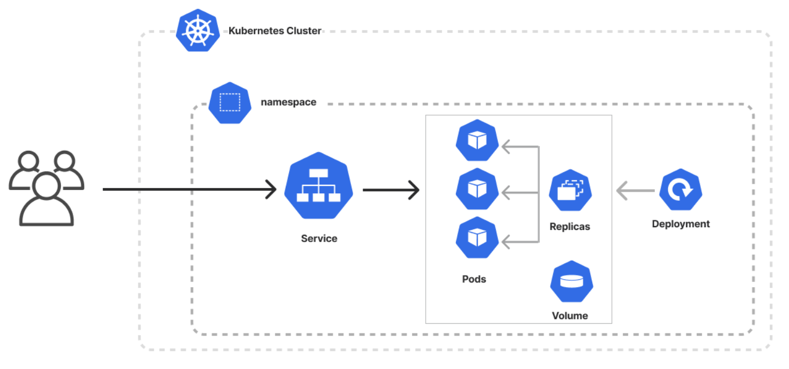

# OBJETOS

[← Regresar a notas](../../README.md)  

----

## 1. Conceptos clave

> #### Objetos
> En K8s cada elemento es conocido como <u>objeto</u>, el cual representa  un estado deseado del clúster y es definido en archivos `yml`.

> #### Infraestructura como código
> A la definición de objetos mediante archivos se le conoce con el nombre de “Infraestructura como código”.

> #### Label
> Pares de clave valor que se asignan como metadata a los objetos de K8s para que puedan ser identificados.

> #### Controllers
> - Tipos de objetos que se encargan de la gestión y el estado de los recursos dentro del clúster. 
> - Garantizan que el estado de una aplicación durante su despliegue coincida con el estado deseado definido en las configuraciones.
> - `Deployment`, `Statefulset` y `Daemonset` son los controllers más populares.

---

## 3. Tipos de objetos

### Pod
- Es la unidad básica de despliegue y ejecución de una aplicación.
- Consiste en un grupo de uno o más contenedores que comparten almacenamiento, red y especificaciones de ejecución.
- <u>Son efímeros</u>. Se crean y destruyen de manera frecuente y automática.
- Controladores como `Deployment`, `Statefulset` y `Daemonset` administran los pods en un clúster de Kubernetes.

---

### Deployment (DEP)
- `controller`
- Asigna a los pods una identificación que no es única ni persistente.
- Ejecuta múltiples réplicas de la aplicación mediante pods y los reemplaza automáticamente si están defectuosos o no responden.

---

### Statefulset (STS)
- `controller`
- Asigna a los pods una identificación única y persistente (Se apoya de volúmenes).
- Útil para aplicaciones que requieren almacenamiento persistente y nombres de red consistentes, como las base de datos.

---

### Daemonset (DS)
- `controller`
- Asegura que haya una instancia del pod en cada nodo del clúster. 
- Es útil para el monitoreo.

--- 

### Service (SVC)
Permite exponer una aplicación que se ejecuta en un conjunto de pods, utilizando etiquetas (labels) y selectores.

Tipos de servicios:
  - #### ClusterIP
    - Proporciona una dirección IP interna <u>accesible únicamente dentro del clúster</u>.
    - Es el tipo predeterminado, ideal para la comunicación entre pods del mismo clúster.
  - #### NodePort
    - Permite el <u>acceso al servicio desde fuera del clúster</u> mediante la IP del nodo y un puerto estático.
  - #### LoadBalancer
    - Expone el servicio mediante un balanceador de carga externo, asignándole una dirección IP pública.
    - Distribuye el tráfico entrante entre los pods del servicio.

---

### Config Map (CM)
- Almacena datos de configuración no sensibles en formato clave-valor.
- Estos datos pueden ser consumidos por los pods mediante variables de entorno, argumentos de línea de comandos o montando archivos de configuración en volúmenes.

---

### Secret (SEC)
- Almacena datos sensibles en base64, como contraseñas, tokens o claves en formato clave-valor.
- Estos datos pueden ser consumidos por los pods de manera segura, evitando la exposición directa de información confidencial.

---

### Persistent Volume (PV)
Representa un almacenamiento duradero y compartido que puede ser utilizado por un pod de la aplicación a la vez.

---

### Persistent Volume Claim (PVC)
- Representa una solicitud hacia un PV. 
- Cuando se crea un PVC, K8s busca un PV que cumpla con las especificaciones del PVC (label, capacidad, modo de acceso, etc.), y lo asigna al PVC.
- Si no hay un PV que coincida con las especificaciones, entonces K8s intenta aprovisionar uno nuevo.
- Tanto el PV como el PVC deben estar en el mismo clúster de K8s.

---

