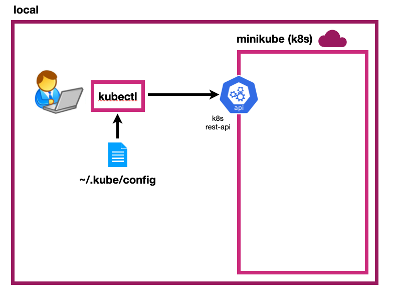

# MINIKUBE

[← Regresar a notas](../../README.md) <br>

---



---

> ### ▶️ Iniciar Minikube
> - Use opcionalmente `--memory=2816 --cpus=4` para especificar los recursos que asignará a Minukube
> - Utilice el contexto `default` de Docker.
> ```shell script
>  docker context use default
>  minikube start --memory=2816 --cpus=4
> ```
---

> ### ▶️ Gestionar Minikube
> ```shell script 
> minikube status
> minikube stop
> minikube delete
> ```
----

> ### 📈 Habilitar dashobard de K8s
> ```shell script 
> minikube dashboard --url
> ```
----

> ### 🔀 Port forwarding de un servicio
> Permite acceder desde nuestro entorno local a los servicios disponibles en el clúster K8s de Minikube.
> ```shell script 
> minikube service --url <service-name>
> ```
----

> ### 🔀 Obtener la IP del clúster
> Esta IP se utiliza para acceder a los servicios desplegados en el clúster. (`<minikube-ip>`:`<k8s-service-port>`)
> ```shell script 
> minikube ip
> ```
----

> ###  ▶️ Abrir sesión en la shell de Minikube
> ```shell script
> minikube ssh
> ```
----

> ### ▶️ Mostrar perfiles de minikube
> ```shell script
> minikube profile list
> ```

----

> ### ▶️ Acceder al Docker de Minikube
> #### Windows
> ```shell script 
>  Invoke-Expression ((minikube docker-env) -join "`n")
> ```
> 
> #### Unix
> ```shell script 
>  eval $(minikube docker-env --shell bash)
> ```
